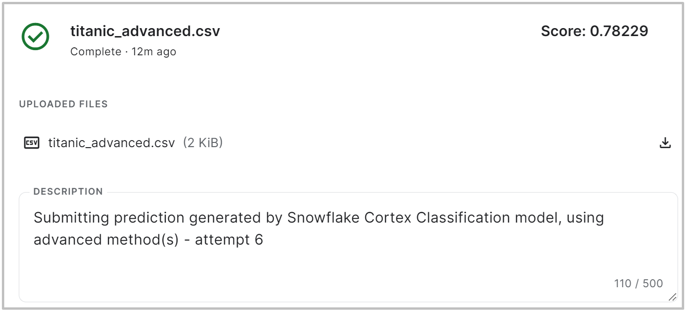

# Titanic: Machine Learning from Disaster

This repository contains my prediction solution for the Kaggle Titanic competition. I used the Snowflake ML Classification model to tackle this challenge, both to learn and to evaluate its efficiency.

## Table of Contents

- [Project Overview](#project-overview)
- [Getting Started](#getting-started)
    - [Prerequisites](#prerequisites)
    - [Download the Data](#download-the-data)
- [Running the Prediction](#running-the-prediction)
- [Submit Prediction](#submit-prediction)
- [Score](#score)
- [Acknowledgements](#acknowledgements)

## Project Overview

The Titanic competition on Kaggle is a classic machine learning challenge. The goal is to build a predictive model that answers the question: "what sorts of people were more likely to survive?" using passenger data (i.e., name, age, gender, socio-economic class, etc.).

I described the entire solution step-by-step in [this article](https://medium.com/@zizek.uros/how-i-solved-the-kaggles-titanic-ml-challenge-using-snowflake-classification-model-5e249563a79e). 

## Getting Started

### Prerequisites

To run the code in this repository, you need to ensure the following prerequisites:

- Create a Kaggle account.
- Install the Kaggle API and configure Kaggle API credentials. Instructions are available [here](https://github.com/Kaggle/kaggle-api/blob/main/docs/).
- Ensure you have an active account on the Snowflake platform. If you don't have one yet, sign up for a Snowflake account on their website.

### Download the Data

Once you have the Kaggle API and credentials configured, you can download the competition data by running:

```
kaggle competitions download -c titanic
```

Unzip the data into the data folder, remove the original zip archive, and you are ready to go:
```
unzip titanic.zip -d data/
rm titanic.zip
```

## Running the Prediction

To run the prediction, follow the steps:

1. Create a new Snowflake Database (in my case it's called KAGGLE).
2. Load the train and test data sets into the tables (in my case they are named `titanic_train` and `titanic_test`).
   - You can do this through the Snowflake Web UI by uploading files through the web browser or by loading them from an S3 bucket. You can use the [these SQL queries](load-data-example.sql) for loading the data that were generated when I was loading the data. Make sure to replace the filename.
   - The data schemes of the tables with train and test data should [look like this](schemas.sql).
3. Run one of the sequences of the queries:
   - [Basic Classification Prediction](snowflake-ml-classification-basic.sql)
   - [Classification Prediction based on some custom features and cleaned data](snowflake-ml-classification-advanced.sql)
4. Save results to a .csv file that only contains two cloumns: 
    - PassengerId
    - Survived

## Submit Prediction

You can submit your score through the Kaggle Web UI or with the Kaggle CLI tool. The following command can be used to do it:

```
kaggle competitions submit -c titanic -f {file} -m "{message}"
```

## Score

The advanced prediction with no some features engineering scored **0.78229**, meaning it successfully predicted for ~78.23% of people whether survived or not. 

I finished in 2810th place out of 17,290 at the time of submitting the results, which is in the **84th percentile**. 



Maybe I'll keep working on it and see if I can improve the score with some feature engineering, or alternative approach.

## Acknowledgements

Thanks ❤️ to Kaggle for providing the Titanic dataset and competition. It is a super fun and educational challenge.
